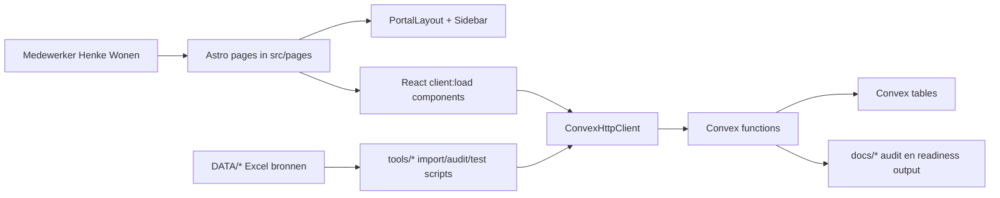

# Projectoverdracht Henke Wonen portal

Datum: 5 mei 2026  
Scope: codebase-inventarisatie, architectuur, dataflows, risico's en verificatie  
Status: gebaseerd op huidige root-codebase `main`

## Korte conclusie

De Henke Wonen portal is een Astro + React Islands applicatie met Convex als backend/data-laag en Vercel als server-rendered deployment target. De applicatie is geen marketingwebsite, maar een backofficeportaal voor klanten, projecten, inmeting, offertes, catalogus, leveranciers, importcontrole, importprofielen en instellingen.

De huidige codebase is technisch coherent en heeft al veel overdrachtsdocumentatie. Typecheck, productiebuild, domeintests, route-smoke tests en lichte a11y-smoke tests slagen op deze inventarisatiedatum.

Belangrijkste aandachtspunt voor verder werken: authenticatie/autorisatie is nog niet productierijp. De default auth-provider is dev/admin en de LaventeCare-provider is een placeholder. Convex-mutaties vertrouwen vooral op tenant-id/tenant-slug argumenten en niet op server-side user identity/role checks.

## Stack

| Laag | Invulling |
| --- | --- |
| Frontend framework | Astro, server output |
| Interactieve UI | React islands via `@astrojs/react` en `client:load` |
| Backend/database | Convex queries en mutations |
| Deployment | `@astrojs/vercel`, Vercel serverless output |
| Styling | Eigen CSS/design tokens in `src/styles/global.css` |
| Icons | `lucide-react` |
| TypeScript | Astro strict config, padalias `@/* -> src/*` |
| Catalog tooling | Node scripts + Python/openpyxl tooling via `tools/run_python_tool.mjs` |

## Architectuur in 1 beeld

## Belangrijkste mappen

| Pad | Functie |
| --- | --- |
| `src/pages` | Astro routebestanden. Vrij dunne wrappers rond layout en React components. |
| `src/components/layout` | Portal shell, sidebar, breadcrumbs. |
| `src/components/ui` | Herbruikbare UI-primitives zoals Button, Card, DataTable, Alert, Field. |
| `src/components/{customers,projects,quotes,...}` | Domein-UI per workflow. |
| `src/lib` | Auth types/providers, Convex client, calculators, formattering, statuslabels, quote document model. |
| `convex` | Schema, queries, mutations, seed/demo-data, importlogica en catalogusreviews. |
| `tools` | Import, audit, reset, seed en smoke-test scripts. |
| `docs` | Klantdocumentatie, technische documentatie, audits, release-readiness en implementatiehistorie. |
| `DATA` | Lokale Excel-bronbestanden, genegeerd door git. |

## Routekaart

| Route | Doel | Hoofdcomponent | Convex functies |
| --- | --- | --- | --- |
| `/portal` | Dashboard en import-readiness | `DashboardShell` | `portal.dashboard`, `catalogReview.productionReadiness` |
| `/portal/klanten` | Klanten zoeken/aanmaken | `CustomerWorkspace` | `portal.listCustomers`, `portal.createCustomer` |
| `/portal/klanten/[id]` | Klantdossier | `CustomerDetail` | `portal.customerDetail`, `portal.createCustomerContact` |
| `/portal/projecten` | Projecten zoeken/aanmaken | `ProjectWorkspace` | `portal.listProjects`, `portal.createProject` |
| `/portal/projecten/[id]` | Projectdetail, workflow, inmeting | `ProjectDetail`, `MeasurementPanel` | `portal.projectDetail`, `portal.addProjectRoom`, `portal.updateProjectStatus`, `portal.createWorkflowEvent`, `measurements.*` |
| `/portal/offertes` | Offertes zoeken/aanmaken | `QuoteWorkspace` | `portal.listQuotesWorkspace`, `portal.createQuote`, `portal.addQuoteLine`, `portal.deleteQuoteLine`, `portal.updateQuoteTerms` |
| `/portal/offertes/[id]` | Offertebuilder | `QuoteWorkspace`, `QuoteBuilder` | idem plus `measurements.listReadyForQuoteByProject`, `measurements.markMeasurementLineConverted` |
| `/portal/catalogus` | Productcatalogus raadplegen | `ProductList` | `catalog.listProductsForPortal` |
| `/portal/catalogus/data-issues` | Dubbele EAN-review | `CatalogDataIssues` | `catalogReview.duplicateEanReview`, `syncDuplicateEanIssues`, `updateDuplicateEanIssueReview` |
| `/portal/leveranciers` | Leveranciersbeheer light | `SupplierWorkspace` | `portal.listSuppliers`, `portal.createSupplier`, `portal.updateSupplierProductListStatus` |
| `/portal/imports` | Importbatches bekijken/verwerken | `ImportPreview` | `imports.listBatchesForPortal`, `imports.getBatchForPortal`, `catalogImport.*` |
| `/portal/imports/[batchId]` | Importbatchdetail | `ImportPreview` | `imports.getBatchForPortal`, `catalogImport.*` |
| `/portal/import-profielen` | Btw-mapping review | `ImportProfiles` | `catalogReview.vatMappingReview`, `updateProfileVatMode`, `bulkUpdateProfileVatModes`, `productionReadiness` |
| `/portal/instellingen/werkzaamheden` | Werkzaamheden tonen | `ServiceRulesSettings` | `portal.listServiceRules` |
| `/portal/instellingen/categorieen` | Categorieen tonen | `CategoriesSettings` | `portal.listCategories` |
| `/portal/instellingen/offertetemplates` | Voorwaarden/betalingsafspraken sjablonen | `QuoteTemplatesSettings` | `portal.listQuoteTemplates`, `portal.updateQuoteTemplateContent` |

## Frontendpatroon

Astro-pagina's lezen `Astro.locals.session`, renderen `PortalLayout`, en mounten daarna een React-component met `client:load`. De echte interactieve logica zit dus vrijwel volledig in React.

Voorbeeldpatroon:

1. Middleware zet `context.locals.session`.
2. `/portal/...` redirect naar `/login` als er geen sessie is.
3. Page geeft `session` door aan layout en component.
4. Component maakt `ConvexHttpClient` met `PUBLIC_CONVEX_URL`.
5. Component roept Convex queries/mutations aan met `session.tenantId` als tenant slug.

## Auth en sessies

Bestanden:

- `src/middleware.ts`
- `src/lib/auth/index.ts`
- `src/lib/auth/session.ts`
- `src/lib/auth/devAuthProvider.ts`
- `src/lib/auth/laventeCareAuthProvider.ts`

Huidige situatie:

- `PUBLIC_AUTH_MODE` bepaalt provider.
- Default is `dev`.
- Dev-provider geeft altijd admin-sessie voor tenant `henke-wonen`.
- LaventeCare-provider bestaat, maar gooit nog bewust een error zodra cookievalidatie nodig is.
- Rollen bestaan als types: `viewer`, `user`, `editor`, `admin`.
- Helpers `canWrite`, `canManage` en `src/lib/permissions.ts` bestaan, maar zijn nog nauwelijks aangesloten.

Risico:

Voor productie moet server-side auth worden afgemaakt en moeten Convex functies autorisatie afdwingen. Alleen client-side session props zijn daarvoor onvoldoende.

## Convex datamodel

Belangrijkste tabellen:

| Cluster | Tabellen |
| --- | --- |
| Tenant en gebruikers | `tenants`, `users` |
| Klanten | `customers`, `customerContacts` |
| Catalogus | `categories`, `suppliers`, `brands`, `productCollections`, `products`, `priceLists`, `productPrices` |
| Import | `productImportBatches`, `productImportRows`, `importProfiles`, `catalogDataIssues` |
| Projecten | `projects`, `projectRooms`, `projectWorkflowEvents`, `timelineEvents` |
| Inmeting | `measurements`, `measurementRooms`, `measurementLines`, `wasteProfiles` |
| Offertes | `quotes`, `quoteLines`, `quoteTemplates`, `serviceCostRules` |
| Toekomst/partial | `supplierOrders`, `invoices` |

De meeste operationele tabellen zijn tenant-scoped. Queries en mutations controleren doorgaans of records bij de tenant horen, maar niet of de ingelogde gebruiker die tenant/rol echt mag gebruiken.

## Convex modules

| Bestand | Rol |
| --- | --- |
| `convex/schema.ts` | Volledig datamodel en indexen. |
| `convex/portal.ts` | Centrale portal API voor dashboard, klanten, projecten, offertes, leveranciers, instellingen. |
| `convex/measurements.ts` | Inmeting, meetruimtes, meetregels, waste profiles, conversie naar offerte. |
| `convex/catalog.ts` | Productcatalogus queries en basis product/prijs mutations. |
| `convex/catalogImport.ts` | Preview batches, import rows, commit chunks, reset import. |
| `convex/catalogReview.ts` | Btw-mapping, duplicate EAN review, production readiness. |
| `convex/imports.ts` | Batch/profile portal views en mapping. |
| `convex/demoSeed.ts`, `convex/seed.ts` | Demo/baseline data. |
| Kleinere modules | `customers.ts`, `projects.ts`, `quotes.ts`, `suppliers.ts`, `categories.ts`, `users.ts`, `tenants.ts`, `serviceCostRules.ts`, `quoteTemplates.ts`. |

## Kernflows

### Klant naar project

De gebruiker maakt een klant aan, maakt daarna een project aan op basis van een bestaande klant, en kan contactmomenten/dossierinformatie vastleggen. Klantbewerken en klantverwijderen zijn geen hoofdflow.

### Project naar inmeting

Projectdetail bevat status, ruimtes, workflowmomenten en `MeasurementPanel`. Inmetingen leggen hoeveelheden en berekeningen vast, niet productkeuzes of prijzen.

Guardrails:

- Inmeting kiest geen product.
- Inmeting kiest geen verkoopprijs.
- Inmeting kiest geen btw.
- Meetregels moeten expliciet klaar voor offerte worden gezet.

### Inmeting naar offerte

`MeasurementLinePicker` haalt meetregels met `ready_for_quote` op. Na selectie en bevestiging maakt de offertebuilder quote lines aan met neutrale prijs/btw placeholders. Pas daarna wordt de meetregel als `converted` gemarkeerd.

Belangrijk gedrag:

- `unitPriceExVat` wordt `0`.
- `vatRate` wordt `0`.
- Metadata bewaart broninformatie.
- Gebruiker moet prijs/product/btw handmatig controleren.

### Offerte

`portal.createQuote` maakt een conceptofferte en zet het project op `quote_draft`. `portal.addQuoteLine` berekent regeltotalen en herberekent offertetotalen. `portal.deleteQuoteLine` is de enige normale portal-hard-delete en herberekent daarna totalen.

PDF/print:

- Er is een quote document model en previewcomponent.
- `QuoteDocumentPreview` gebruikt browserprint.
- Volledige PDF/export/factuurflow is nog geen productierijpe hoofdflow.

### Catalogus en import

Catalogus is vooral raadplegen/zoeken. Productbeheer bestaat deels in Convex, maar is niet als volledige portalflow gebouwd.

Importstraat:

1. Python tooling leest Excelbestanden uit `DATA`.
2. Preview/audit output gaat naar `docs/catalog-import-summary.*`.
3. Node scripts maken Convex preview batches/rows.
4. Portal toont batches, warnings, errors en reconciliation.
5. Commit verwerkt chunks naar producten en prijzen.

Productie-import guardrails:

- Geen commit bij foutregels.
- Geen commit bij duplicate source keys.
- Geen unknown btw-modus zonder bewuste override.
- Production readiness is `READY` pas als unresolved btw-mappings 0 zijn.
- Duplicate EAN is review-only en blokkeert import niet automatisch.

## Scripts

| Script | Doel |
| --- | --- |
| `npm run dev` | Astro devserver. |
| `npm run check` | Astro/TypeScript diagnostics. |
| `npm run build` | Check + server build voor Vercel. |
| `npm run catalog:audit` | Data-audit op Excelbrondata. |
| `npm run catalog:preview` | Bouwt cataloguspreview en summary docs. |
| `npm run catalog:import` | Productie-import met guardrails. |
| `npm run catalog:import:dev` | Dev-import met expliciete unknown-btw override. |
| `npm run catalog:reset` | Destructieve catalogusreset met expliciete confirm flag in script. |
| `npm run portal:demo-seed` | Convex demo-data seed. |
| `npm run test:portal` | HTTP route-smoke test tegen lokale devserver. |
| `npm run test:a11y` | Lichte HTML/a11y/copy smoke test tegen lokale devserver. |
| `npm run test:calculators` | Calculator unit checks. |
| `npm run test:quote-document` | Quote document model/preview checks. |
| `npm run test:workflow-guardrails` | Statische guardrail checks op mutaties en deletegedrag. |

## Configuratie

Tracked config:

- `astro.config.mjs`: `output: "server"`, Vercel adapter, React integration, Convex noExternal voor SSR.
- `tsconfig.json`: Astro strict, `jsx: react-jsx`, alias `@/*`.
- `.gitignore`: sluit onder andere `DATA`, `.env*`, `dist`, `.vercel`, logs, audit JSON en generated docs uit.

Lokale env keys aanwezig, waarden niet gedocumenteerd:

- `CONVEX_DEPLOYMENT`
- `PUBLIC_CONVEX_URL`
- `PUBLIC_CONVEX_HTTP_ACTIONS_URL`
- `PUBLIC_AUTH_MODE`
- `CONVEX_SITE_URL`

## Huidige verificatie op 5 mei 2026

Uitgevoerd:

| Command | Resultaat |
| --- | --- |
| `npm run check` | Geslaagd: 0 errors, 0 warnings, 0 hints. |
| `npm run test:calculators` | Geslaagd. |
| `npm run test:quote-document` | Geslaagd. |
| `npm run test:workflow-guardrails` | Geslaagd. |
| `npm run test:portal` | Geslaagd: 12 routes HTTP 200 en basislabels aanwezig. |
| `npm run test:a11y` | Geslaagd: 12 routes, geen issues in lichte smoke check. |
| `npm run build` | Geslaagd. |

Build-waarschuwing:

- Lokale Node.js versie is 25.
- Vercel Serverless Functions ondersteunen die lokale versie niet.
- Build valt terug op Node.js 24 als runtime.
- Advies: ontwikkel lokaal met Node 24 om runtimeverschillen te voorkomen.

In-app browser verificatie:

- Devserver startte op `http://127.0.0.1:4321/`.
- Server-rendered routechecks zijn geslaagd.
- De Codex in-app browserclient liep vast op tabinitialisatie (`Page.enable` timeout), dus er is geen aanvullende visuele screenshot-QA vastgelegd in deze ronde.

## Belangrijkste open punten

1. Auth productie: LaventeCare/JWT/JWKS of `/auth/me` koppeling moet nog echt worden aangesloten.
2. Autorisatie: Convex mutations moeten server-side rol/tenant permissies afdwingen.
3. PDF/factuur: quote preview/print bestaat, maar volledige PDF/factuurflow is nog niet af.
4. Boekhouding: workflowmomenten bestaan, geen technische export/koppeling.
5. Agenda: Outlook/Hotmail integratie is niet gebouwd.
6. Productbeheer: catalogus is raadpleegscherm; volledige product CRUD zit niet in hoofd-UI.
7. Instellingen: werkzaamheden en categorieen zijn read-only in UI.
8. Klantbeheer: klantupdate/delete en volledige uitleen-retourflow zijn niet volledig aangesloten.
9. Import readiness: zakelijke btw-mappingbeslissingen blijven bepalend voor productie-import.
10. Performance: sommige queries halen volledige tenant-collecties op en filteren/sorteren in memory. Voor grotere productiesets moet server-side pagination/search per module opnieuw bekeken worden.

## Aanpak voor verder werken

Aanbevolen volgorde voor nieuwe ontwikkeling:

1. Begin met gewenste klantworkflow in `docs/klant` of bestaande technische map.
2. Zoek de route in `src/pages`.
3. Volg de React component in `src/components/<domein>`.
4. Volg de Convex functie in `convex/portal.ts` of domeinmodule.
5. Check het schema en tenant-scope in `convex/schema.ts`.
6. Voeg of wijzig tests passend bij risico:
   - calculators: `test:calculators`
   - offerte/document: `test:quote-document`
   - workflow/delete/guardrails: `test:workflow-guardrails`
   - routes/a11y: devserver + `test:portal` + `test:a11y`
7. Draai altijd `npm run check` en bij deploy/release `npm run build`.

Voor klantdemo's:

- Gebruik dev auth alleen bewust.
- Controleer dat `PUBLIC_CONVEX_URL` naar de juiste Convex omgeving wijst.
- Seed demo-data alleen in de bedoelde omgeving.
- Gebruik `catalog:import:dev` niet als productiepad.

Voor productievoorbereiding:

- Maak auth/permissions eerst hard.
- Zet lokale Node op 24.
- Rond btw-mappingbeslissingen af.
- Voer import-preview en production-readiness opnieuw uit.
- Leg releasebeslissingen vast in `docs/release-readiness`.
