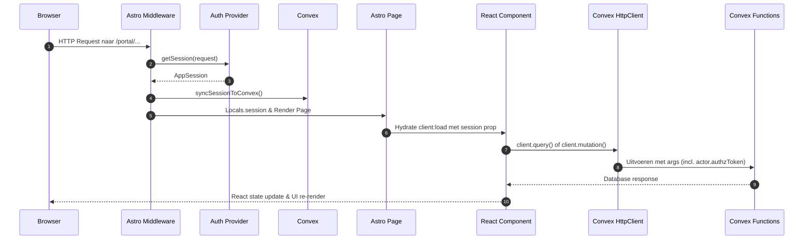
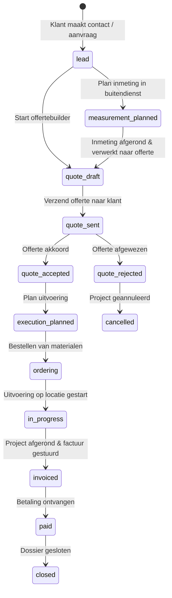
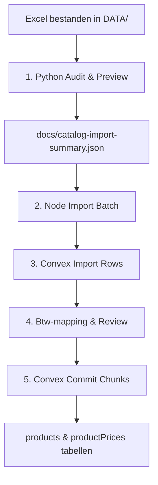

# Technisch Vooronderzoeksrapport & Projectkaart: Henke Wonen Portal

Dit rapport dient als de definitieve technische projectkaart en het resultaat van het uitgevoerde vooronderzoek voor de **Henke Wonen Portal**. Het brengt de volledige codebase, datastructuren, routeringspaden, beveiligingsmechanismen en importpipelines in kaart om toekomstige ontwikkeling en stabilisatie te stroomlijnen.

---

## 🚀 1. Runtime, Stack & Diagnostische Status

### De Technologie-Stack
De portal is opgebouwd als een hybride webapplicatie die server-side rendering (SSR) combineert met dynamische interactieve UI-componenten:

| Laag | Technologie | Details & Rol |
| --- | --- | --- |
| **Frontend Framework** | Astro v6.1.10 | Server-rendered pagina's (`output: "server"`), routering en middleware. |
| **Interactieve Islands** | React v19.2.5 | Client-side dynamische UI via `@astrojs/react` en `client:load`. |
| **Database & Backend** | Convex v1.39.1 | Real-time database queries en mutations met server-side validatie. |
| **Deployment Adapter** | `@astrojs/vercel` | Serverless en edge handler builds voor Vercel hosting. |
| **Styling & CSS** | Tailwind CSS v4.3.0 | Custom utility styling opgebouwd in [src/styles/global.css](file:///c:/Users/JJALa/Desktop/2026Developer/HenkeWonen/src/styles/global.css). |
| **Icoonbibliotheek** | Lucide React v1.14.0 | Vector-iconen voor UI-acties. |
| **Catalog Tooling** | Node.js + Python 3 | Excel-verwerking en import met `openpyxl` en `pypdf`. |

### Runtime & Node-versie
Het project is strikt geconfigureerd voor **Node.js 24.x** (npm 11.x) via:
*   `engines.node = "24.x"` in `package.json`.
*   `engine-strict=true` in `.npmrc`.
*   Een Windows-helper om Node 24 te forceren: [tools/use-node24.ps1](file:///c:/Users/JJALa/Desktop/2026Developer/HenkeWonen/tools/use-node24.ps1).

### Diagnostische Status
*   **Type-safety check (`npm run check`)**: valideert Astro en TypeScript.
*   **Volledige testset (`npm test`)**: draait de Vitest-suite met calculators, workflow guardrails, offertedocumenten, route smoke en lichte a11y/copy checks.

---

## 🗺️ 2. Route- & Component-Mapping (Dataflow-architectuur)

Elke pagina in de portal volgt een voorspelbare datastroom van de browser, via de Astro-middleware, naar de React Islands en uiteindelijk naar de Convex-database:

### De Belangrijkste Entrypoints (Astro) & React Componenten

1.  **Dashboard (`/portal`)**:
    *   *Astrobestand:* [src/pages/portal/index.astro](file:///c:/Users/JJALa/Desktop/2026Developer/HenkeWonen/src/pages/portal/index.astro)
    *   *React-component:* `DashboardShell` (dashboardtellingen, waarschuwingen).
    *   *Convex-koppeling:* `portal.dashboard`, `catalogReview.productionReadiness`.
2.  **Klantbeheer (`/portal/klanten`)**:
    *   *Astrobestand:* [src/pages/portal/klanten/index.astro](file:///c:/Users/JJALa/Desktop/2026Developer/HenkeWonen/src/pages/portal/klanten/index.astro)
    *   *React-component:* `CustomerWorkspace` (klantzoeker, klant toevoegen).
    *   *Convex-koppeling:* `portal.listCustomers`, `portal.createCustomer`.
3.  **Project & Inmeting (`/portal/projecten/[id]`)**:
    *   *Astrobestand:* [src/pages/portal/projecten/[id].astro](file:///c:/Users/JJALa/Desktop/2026Developer/HenkeWonen/src/pages/portal/projecten/[id].astro)
    *   *React-component:* `ProjectDetail` en `MeasurementPanel` (inmeetcalculators voor ruimtes).
    *   *Convex-koppeling:* `portal.projectDetail`, `portal.addProjectRoom`, `measurements.getForProject`, `measurements.addMeasurementLine`.
4.  **Offertebuilder (`/portal/offertes/[id]`)**:
    *   *Astrobestand:* [src/pages/portal/offertes/[id].astro](file:///c:/Users/JJALa/Desktop/2026Developer/HenkeWonen/src/pages/portal/offertes/[id].astro)
    *   *React-component:* `QuoteBuilder` (handmatige invoer, sjabloonregels inladen, inmeetregels converteren naar offerteposten).
    *   *Convex-koppeling:* `portal.listQuotesWorkspace`, `portal.addQuoteLine`, `measurements.listReadyForQuoteByProject`.
5.  **Cataloguszoeker (`/portal/catalogus`)**:
    *   *Astrobestand:* [src/pages/portal/catalogus/index.astro](file:///c:/Users/JJALa/Desktop/2026Developer/HenkeWonen/src/pages/portal/catalogus/index.astro)
    *   *React-component:* `ProductList` (paginated productlijst, leveranciers- en categoriefilters).
    *   *Convex-koppeling:* `catalog.listProductsForPortal`.

---

## 🗄️ 3. Convex Datamodel & Transitiematrix

Het datamodel is strikt gescheiden per tenant (tenant-isolation) en is gedefinieerd in [convex/schema.ts](file:///c:/Users/JJALa/Desktop/2026Developer/HenkeWonen/convex/schema.ts).

### Entiteiten-groepen en Relaties

*   **Tenant & Gebruiker:** `tenants` (roots) $\rightarrow$ `users` (gekoppeld aan een externe gebruiker van LaventeCare of dev-id).
*   **Klanten & Dossiers:** `customers` $\rightarrow$ `customerContacts` (contactmomenten, opmerkingen, uitleen-registratie).
*   **Projecten & Inmetingen:** `projects` $\rightarrow$ `projectRooms`. Elk project kan een `measurements` record bevatten, welke is onderverdeeld in `measurementRooms` en berekeningsregels (`measurementLines`).
*   **Offertes:** `quotes` $\rightarrow$ `quoteLines` (offerteposten gekoppeld aan `products` of `serviceCostRules` (werkzaamheden)).
*   **Catalogus & Import:** `suppliers` $\rightarrow$ `priceLists` $\rightarrow$ `products` & `productPrices`. `productImportBatches` en `productImportRows` bevatten de tijdelijke staging-data tijdens Excel-import.

### Project & Offerte Statussen (Transitiematrix)

De status van een project bepaalt welke acties openstaan en stuurt de workflow. Hieronder staat de levenscyclus van statusovergangen beschreven:

---

## 🔒 4. Beveiliging, Autorisatie & Tenant-Isolatie

De portal gebruikt een hybride autorisatiemodel om tenant-isolatie en rolbeveiliging af te dwingen in een serverless (Convex) omgeving:

### 1. Cryptografische Token Verificatie (`authzToken`)
Er is geen direct cookiesession-beheer in Convex. In plaats daarvan:
*   Zodra de Astro-middleware een sessie herkent, genereert de server een cryptografische token (`createSessionAuthzToken`) ondertekend met `AUTHZ_TOKEN_SECRET` (HMAC SHA-256).
*   De payload bevat: `kind: "actor"`, `sub: userId`, `tenant: tenantSlug`, `exp` (vervaltijd van 8 uur).
*   De token wordt als argument (`actor: { externalUserId, authzToken }`) meegezonden bij elke Convex-mutation.
*   Convex-mutations decoderen de token en verifiëren de handtekening via `verifyToken` in [convex/authz.ts](file:///c:/Users/JJALa/Desktop/2026Developer/HenkeWonen/convex/authz.ts).

### 2. Tenant- & Rolvalidatie
Nadat de token is gevalideerd, controleert Convex:
*   Of de gebruiker bestaat in de database via `users` (`by_external_user` index).
*   Of de gebruiker daadwerkelijk behoort tot de opgegeven tenant (`user.tenantId === tenant._id`).
*   Of de rol van de gebruiker (`viewer`, `user`, `editor`, `admin`) de mutatie mag uitvoeren (`allowedRoles.includes(user.role)`).

### Ontwikkelmodus (Dev Auth Bypass)
Als `AUTHZ_TOKEN_SECRET` ontbreekt (lokale dev) en `ALLOW_DEV_AUTHZ_TOKENS=true` is ingesteld in de omgevingsvariabelen, accepteert de token-parser een ongetekende string van het formaat `dev.actor.<tenantSlug>.<userId>`. 
> [!WARNING]
> In productieomgevingen moet `ALLOW_DEV_AUTHZ_TOKENS` expliciet op `false` (of niet-gedefinieerd) staan om spoofing van tenant- en user-identiteiten te blokkeren.

---

## 📊 5. De Importstraat & Datakwaliteit-Pipeline

De importstraat verwerkt product- en prijslijsten van leveranciers (o.a. ZTAHL, Unilin, Texdecor, Lamelio, Hebeta). Het importproces is een 5-staps pipeline:

### De Pipeline Stappen in Detail

1.  **Python Audit & Preview:**
    *   *Script:* [tools/audit_excel_data.py](file:///c:/Users/JJALa/Desktop/2026Developer/HenkeWonen/tools/audit_excel_data.py) & [tools/build_catalog_import.py](file:///c:/Users/JJALa/Desktop/2026Developer/HenkeWonen/tools/build_catalog_import.py).
    *   *Functie:* Leest Excel-bestanden (inclusief legacy `.xls` die via cache naar `.xlsx` worden omgezet). Normaliseert kolomnamen, detecteert logistieke kolommen (zoals `palletQuantity`, `bundleSize`), en signaleert fouten (zoals onbekende btw-modi of ontbrekende artikelnummers).
    *   *Output:* Genereert `docs/catalog-import-summary.json` en de previewbestanden.
2.  **Node Import Batch:**
    *   *Script:* [tools/upload_catalog_batch_import.mjs](file:///c:/Users/JJALa/Desktop/2026Developer/HenkeWonen/tools/upload_catalog_batch_import.mjs).
    *   *Functie:* Uploadt de gegenereerde preview JSON naar Convex en maakt een `productImportBatches` record aan.
3.  **Convex Import Rows:**
    *   De rijen worden opgesplitst in chunk-payloads en opgeslagen in `productImportRows`. De status van de batch wordt `needs_mapping` of `ready_to_import`.
4.  **Btw-mapping & Review:**
    *   *Guardrail:* Als een prijskolom de btw-status `unknown` heeft (bijvoorbeeld bij kolommen zonder expliciet vermelde btw-modus in de header), blokkeert de import.
    *   *Oplossing:* De beheerder moet in de portal (`/portal/import-profielen`) per kolom de juiste btw-modus kiezen (inclusief of exclusief) of een expliciete uitzondering toestaan. Zodra alle openstaande btw-mappings zijn opgelost, verandert de batch-status naar `ready_to_import` en wordt de `productionReadiness` vlag op `READY` gezet.
5.  **Convex Commit Chunks:**
    *   *Script:* [convex/catalogImport.ts](file:///c:/Users/JJALa/Desktop/2026Developer/HenkeWonen/convex/catalogImport.ts).
    *   *Functie:* Schrijft de gevalideerde importrijen definitief weg naar de `products` en `productPrices` tabellen.

### Kritieke Guardrails
*   **Geen Commit bij Foutregels:** Als er rijen zijn met de status `error` (bijvoorbeeld een ontbrekende naam of artikelnummer), is de commit-knop geblokkeerd.
*   **Duplicate EAN Review:** Dubbele EAN-nummers worden getoond ter beoordeling in `/portal/catalogus/data-issues`, maar worden *nooit* automatisch samengevoegd of overschreven. EAN is een ondersteunend signaal en geen primaire unieke sleutel.
*   **PVC-Click Uitsluiting:** Op expliciet verzoek van de klant (2026-05-19) worden producten die onder de categorie `pvc-click` vallen automatisch gemarkeerd als `ignored` en niet geïmporteerd.

---

## 📝 6. Conclusie & Stabiliteits-Baseline

Dit vooronderzoek toont aan dat de codebase van Henke Wonen op dit moment:
1.  **Technisch gezond en stabiel is**: alle diagnostische typechecks, calculators en integratietests slagen foutloos.
2.  **Fijnmazige beveiligings- en isolatiepatronen hanteert**: het `authzToken`-systeem voorziet Convex op een correcte manier van tenant- en rolbeveiliging op mutatieniveau.
3.  **Een robuuste importstraat heeft**: de btw-mappings en import-guardrails voorkomen dat corrupte of onvolledige prijsinformatiemappen de database vervuilen.

Met deze gedetailleerde projectkaart en de vastgelegde baseline kunnen toekomstige functionele uitbreidingen of beveiligingsremissies (zoals de definitieve koppeling met de LaventeCare IAM-provider) met een minimaal risico op regressie worden uitgevoerd.
